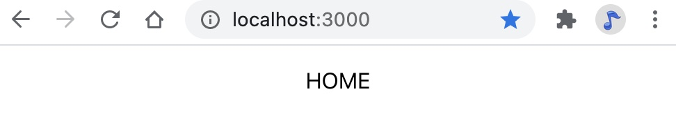
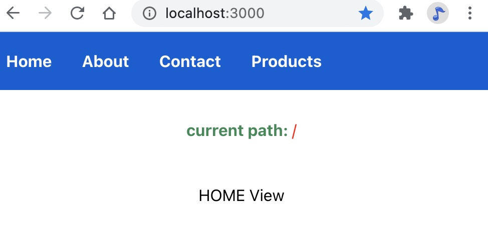
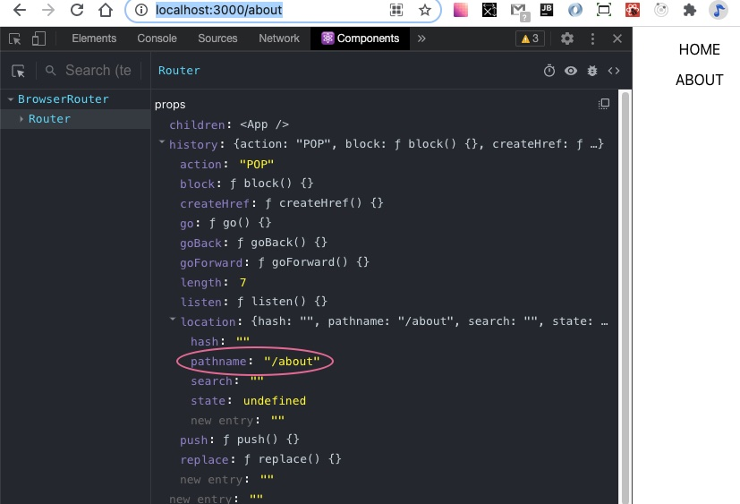
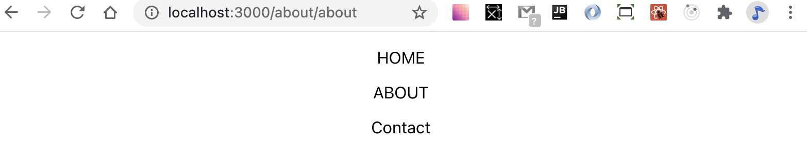
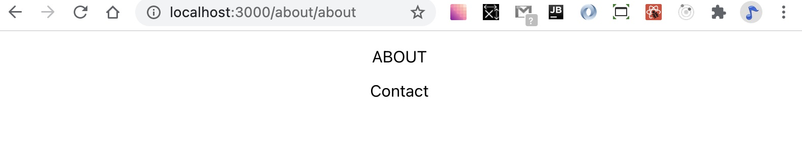
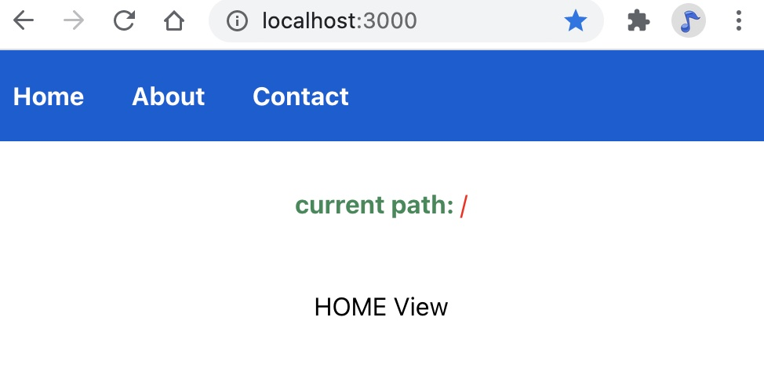
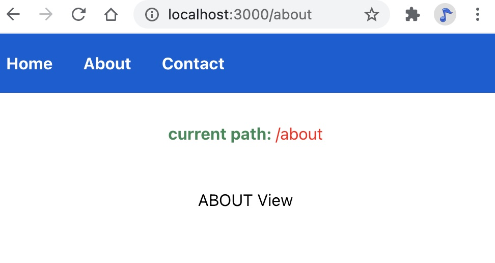
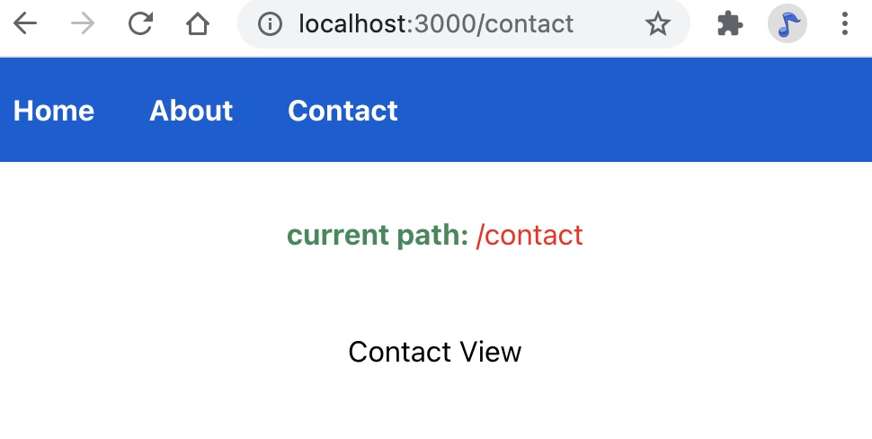

#### React Router demo

This tutorial introduces the features of React Router ver 5. Each section has its own branch to help demonstrate how all of these features work together.

##### Initial setup with basic routes
 This section will show how to implement the following fundamental React Router components:

 - BrowserRouter
 - Route
 - Switch

A React application is typically composed of multiple React components with each component representing a specific view. React Router allows your React application to select a specific view while hiding the other available views. Each view is distinguished by a unique `route` that is defined with the `Route` component. Accessing these views is called `routing`. The highest view of your React application, usually `App.js`, should to be wrapped in the `BrowserRouter`component. This will enable all child components of `App` to be defined by unique routes.

1) Install `react-router-dom` after creating the default React app

~~~ bash 
    yarn add react-router-dom
~~~
2) Wrap the `App` component with BrowserRouter within `index.js`. `BrowserRouter` is usually defined with the alias `Router`.

    ~~~ js
    import {BrowserRouter as Router} from 'react-router-dom';

    ReactDOM.render(
    <React.StrictMode>
        <Router>
            <App />
        
        </Router>
    </React.StrictMode>,
    document.getElementById('root')
    );
    ~~~

3) Create some basic simple views represented by React components. For now, a simple functional component with something inside that lets you distinguish a specific view is enough to demonstrate how routing will work.

    ~~~ js
    import React from 'react';

    const Home = () => {

        return (
            

                
 HOME 

            
            

        )

    }

    export default Home;
    ~~~
    
    ~~~ js
    import React from 'react';

    const About = () => {

        return (
            

                
 ABOUT 
        
            

        )

    }

    export default About;
    ~~~

    ~~~ js
    import React from 'react';

    const Contact = () => {

        return (
            

                
 Contact 
        
            

        )

    }

    export default Contact;
    ~~~

4) Within `App.js`, use `Route` component to match a route with a specific component. Additionally, make sure to import the `Route` component. It is important to notice that the child component defined within each `Route` component, the the view that should be rendered. However, manually typing in each route in the browser will result in some unexpected behavior. 

    ~~~ js
    ...
    import {Route} from 'react-router-dom';
    import Home from './comp/Home';
    import About from './comp/About';
    import Contact from './comp/Contact';
    ...
    

        <Route path = '/' > <Home /> </Route>
        <Route path = '/about'> <About /> </Route>  
        <Route path = '/contact'> <Contact /> </Route>  
    

    ~~~

    However, manually typing in each route in the browser will result in some unexpected behavior. Manually typing in the routes defined with each path should reveal the issue.

    - The root path, '/'  works as expected.
             

    - However, the '/about' path renders both the `root` route and the `about` route.
    

    What is happening ?
    Internally, React Router converts the path string into a regular expression. The `Router` component used in `index.js` to wrap the `App` component creates a `history` obj. Within is a `location object` that describes the pathname. It is this pathname that is matched within the regular expression. The paths for `/` and `/about` both match the converted regular expression. 

    
    
    A fix for this is to use the `exact` prop for the root path.
    
    ~~~ js
    <Route exact path = '/' > <Home /> </Route>
    ~~~

    
    
    
    It may be the intention to render multiple components. In this situation, the `Switch` component cannot be used. The following examples show how to render multiple components.

    ~~~ js
        <Route path = '/'> <Home /> </Route>
        <Route path = '/about'> <About /> </Route> 
        <Route path = '/about/about'> <Contact /> </Route>   
        <Route path = '/contact'> <Contact /> </Route>
    ~~~

    

    ~~~ js
        <Route exact path = '/'> <Home /> </Route>
        <Route path = '/about'> <About /> </Route> 
        <Route path = '/about/about'> <Contact /> </Route>   
        <Route path = '/contact'> <Contact /> </Route> 
    ~~~

    

    If only one component should be rendered, `React Router` has a solution. Wrapping all of the Route components in a `Switch` component will return the first matching component. It is sill necessary to include the exact prop since only one route will be returned and first matched path will be '/'. Using the `Switch` component is an easy way to make sure each route associated with a unique view. 

##### Navigating between routes

Using the  `anchor` tag  to navigate between routes forces the browser to reload the entire page. Since React Router only renders views that match the current path, a page refresh is unecessary. Instead, `React Router` uses the `Link` component to refresh views. Each `Link` component uses a `to` prop to match the view to the `path` defined in each `Route` component. Since the `Route` component was defined inside of `App`, any child of `App` can also recognize a valid route path. The `to` prop works like the anchor tag `href` attribute. However, the `to` prop convert the `to` string into a location object. React Router ver 5 includes a useLocation hook that returns the `location object`. The pathname of the `location object` changes for any valid URL route.

1) A simple navigation component can be built from several `Link` components and the useLocation hook to see how React Router tracks the current pathname.

    ~~~ js
    import React from 'react';
    import {Link, useLocation} from 'react-router-dom';

    const Nav = () => {

        const locationHook = useLocation();

        return (
            

                <Link to = '/' > Home </Link>
                <Link to = '/about'> About </Link>
                <Link to = '/contact'> Contact </Link>        
                
 current path: {locationHook.pathname} 

            

        )
    }

    export default Nav;
    ~~~

2) Including a navigation component inside of `App` will render the navigation component on every valid route.

    ~~~ js
        

            <Nav />

            <Switch>
                <Route exact path = '/'> <Home /> </Route>
                <Route path = '/about'> <About /> </Route>   
                <Route path = '/contact'> <Contact /> </Route>  
            </Switch>
            
        

    ~~~

    
    
    

##### Dynamic Routes