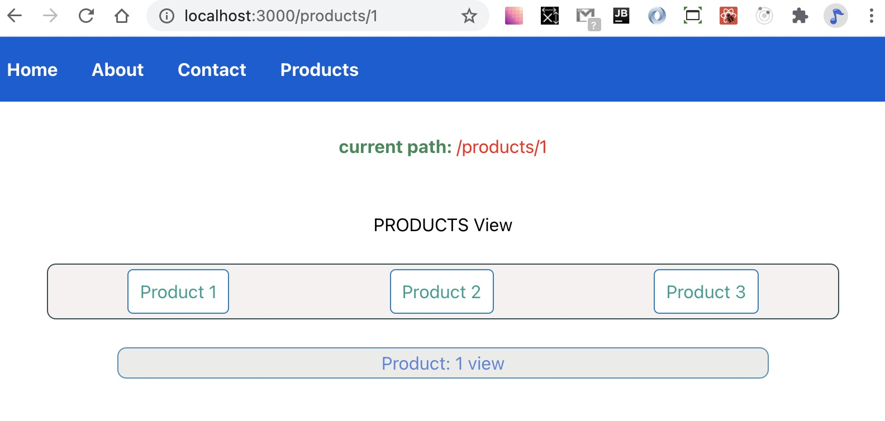
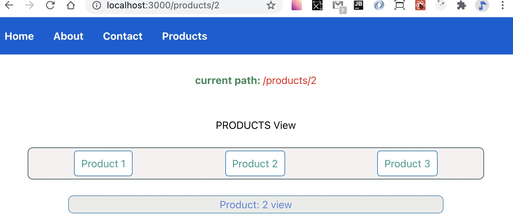
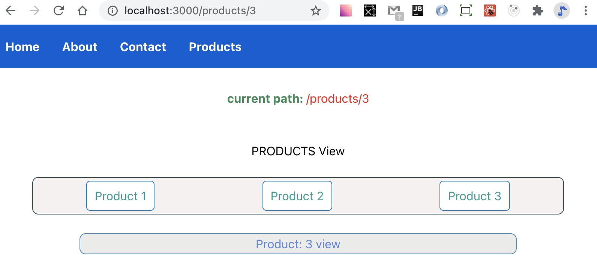

#### React Router demo

This tutorial introduces the features of React Router ver 5. Each section has its own branch to help demonstrate how all of these features work together.

##### Initial setup with basic routes
 This section will show how to implement the following fundamental React Router components:

 - BrowserRouter
 - Route
 - Switch

A React application is typically composed of multiple React components with each component representing a specific view. React Router allows your React application to select a specific view while hiding the other available views. Each view is distinguished by a unique `route` that is defined with the `Route` component. Accessing these views is called `routing`. The highest view of your React application, usually `App.js`, should to be wrapped in the `BrowserRouter`component. This enables routing within `App` and any child components. The `Route` component has a `path` prop that corresponds to a specific view. If a match occurs, the `Route component` will renders its children. `Route` will render `null` if a match is not found. 

1) Install `react-router-dom` after creating the default React app

~~~ bash 
    yarn add react-router-dom
~~~
2) Wrap the `App` component with BrowserRouter within `index.js`. `BrowserRouter` is usually defined with the alias `Router`.

    ~~~ js
    import {BrowserRouter as Router} from 'react-router-dom';

    ReactDOM.render(
    <React.StrictMode>
        <Router>
            <App />
        
        </Router>
    </React.StrictMode>,
    document.getElementById('root')
    );
    ~~~

3) Create some basic simple views represented by React components. For now, a simple functional component with something inside that lets you distinguish a specific view is enough to demonstrate how routing will work.

    ~~~ js
    import React from 'react';

    const Home = () => {

        return (
            

                
 HOME 

            
            

        )

    }

    export default Home;
    ~~~
    
    ~~~ js
    import React from 'react';

    const About = () => {

        return (
            

                
 ABOUT 
        
            

        )

    }

    export default About;
    ~~~

    ~~~ js
    import React from 'react';

    const Contact = () => {

        return (
            

                
 Contact 
        
            

        )

    }

    export default Contact;
    ~~~

4) Within `App.js`, use `Route` component to match a route with a specific component. Additionally, make sure to import the `Route` component. The `path` prop defines routes and corresponds with a specific view. The child component wrapped by each `Route` component defines the view.  

    ~~~ js
    ...
    import {Route} from 'react-router-dom';
    import Home from './comp/Home';
    import About from './comp/About';
    import Contact from './comp/Contact';
    ...
    

        <Route path = '/' > <Home /> </Route>
        <Route path = '/about'> <About /> </Route>  
        <Route path = '/contact'> <Contact /> </Route>  
    

    ~~~

    However, manually typing in the path for each route directly in the browser will result in some unexpected behavior.

    - The root path, '/'  works as expected.
         

    - However, the '/about' path renders both the `root` route and the `about` route.
        

    What is happening ?
    Under the hood, the `Router` component used in `index.js` to wrap the `App` component creates a `history` obj using the `HTML5 history API`. Within the history object is a `location object` that includes a pathname property. When the pathname is a string, React Router converts the path string into a regular expression. The paths for `/` and `/about` both match the converted regular expression. 

    
    
    A simple fix for this is to use the `exact` prop for the root path. This forces React Router to chose an exact match.
    
    ~~~ js
    <Route exact path = '/' > <Home /> </Route>
    ~~~

    
    
    
    In some applications, rendering multiple components may be desired. The following examples show how to render multiple components.

    ~~~ js
        <Route path = '/'> <Home /> </Route>
        <Route path = '/about'> <About /> </Route> 
        <Route path = '/about/about' > <About /> </Route>
        <Route path = '/contact'> <Contact /> </Route>
        <Route path = '/products'> <Products /> </Route>
    ~~~

    

    ~~~ js
        <Route exact path = '/'> <Home /> </Route>
        <Route path = '/about'> <About /> </Route> 
        <Route path = '/about/about' > <About /> </Route>
        <Route path = '/contact'> <Contact /> </Route>
        <Route path = '/products'> <Products /> </Route>
    ~~~

    

    React Router provides a simple way to make sure a single component is rendered. Wrapping all of the Route components in a `Switch` component will return the first matched component. It is still necessary to include the exact prop since only one route will be returned and first matched path will be '/'. Using the `Switch` component is an easy way to make sure each route associated with a unique view. 

##### Navigating between routes

Using the  `anchor` tag  to navigate between routes forces the browser to reload the entire page. Since React Router only renders views that match the current path, a page refresh is unnecessary. Instead, `React Router` uses the `Link` component to refresh views. Each `Link` component uses a `to` prop to match the view to the `path` defined in each `Route` component. Since the `Route` component was defined inside of `App`, any child of `App` can also recognize a valid route path. The `to` prop is a bit like the anchor tag `href` attribute. However, the `to` prop converts the `to` string into a location object. The pathname of the `location object` changes for any valid URL route. React Router ver 5 includes a useLocation hook that returns the `location object`.

1) A simple navigation component can be built from several `Link` components. The useLocation hook is used to display the current pathname property. Some simple styling is added via `nav.css`.

    ~~~ js
    import React from 'react';
    import {Link, useLocation} from 'react-router-dom';

    import './nav.css';

    const Nav = () => {

        const locationHook = useLocation();

        return (
            

                

                    

                        <Link to = '/' className = 'main-link'> Home </Link>
                        <Link to = '/about' className = 'main-link'> About </Link>
                        <Link to = '/contact' className = 'main-link'> Contact </Link>        
                    
                    
                    

                

                

                    
  current path:  
                         {locationHook.pathname} 
                        
                    
                    

                

            

        )
    }

    export default Nav;
    ~~~

2) Including a navigation component inside of `App` will render the navigation component on every valid route.

    ~~~ js
        

            <Nav />

            <Switch>
                <Route exact path = '/'> <Home /> </Route>
                <Route path = '/about'> <About /> </Route>   
                <Route path = '/contact'> <Contact /> </Route>  
            </Switch>
            
        

    ~~~

    
    
    

##### Nested Routes Basics

React Router can also render routes within another route path. For example, the`/products` route view might show a list of products while the route `/products/1` renders a view for the first product. This powerful feature of React Router is often implemented by mapping through data received from an API call. Each element receives its own `<Link` element. Each `Link` component receives a `template literal` within its `to` prop to handle to dynamic portion of the route assigned while mapping through the API data. However, each `Link` must match the path defined in a `Route` in order to render something. This is accomplished again using template literals. A single `Route` component can use a template literal within its `path` prop. The template literal defines the dynamic portion of the path.

1) Create a `Product` component to handle sample API data.
    - the key for each mapped element(product.id) is used in a placeholder within the template literal.
    - the `Route` component uses the variable `idVal` within its `path` prop.
   - the preceding colon tells React Router that a variable comes next. This variable MUSt be the same one used in the rendered child component of `Route`
   - every nested route will also contain the mapped <Link>. This is similar to how the <Nav> component defined within `App` is rendered in every component. There is a way to modify this behavior but for now we ill focus on the basics of nested routing.  

        ~~~ js
        import {infoData} from '../data/infodata';

        const Products = () => {
            
            return (
                

                    
  PRODUCTS 

                    {infoData.map( (product) => {
                        return (
                            
 
                                <Link to = {`/products/${product.id}`}>  {product.productName} </Link>
                            
                            

                        )
                    
                    }) }

                    <Route exact path = {`/products/:idVal`} >
                        <Product/>
                    
                    </Route>

                    

                

            )
        }

        export default Products;
        ~~~

2) Create a `Product` component

   - the useParams() hook can identify the dynamic portion of the path so we can see the different view for `Product`
   - the destructured variable MUST match the variable used in the `Products` `Route` path

        ~~~ js
        import React from 'react';
        import {useParams} from 'react-router-dom';

        const Product = () => {

            const {idVal} = useParams();

            return (
                
 Product: {idVal}

            
            )

        }

        export default Product;
        ~~~

    Each nested route will now show a unique current path and view

3) Add a `Link` to the `products` route to the `Nav` component

    ~~~ js
    

        <Link to = '/' className = 'main-link'> Home </Link>
        <Link to = '/about' className = 'main-link'> About </Link>
        <Link to = '/contact' className = 'main-link'> Contact </Link>    
        <Link to = '/products' className = 'main-link'> Products </Link>    
    

    ~~~

4) Add a `Route` component to the `products` path within `App`

    ~~~ js
    <Switch>
        <Route exact path = '/'> <Home /> </Route>
        <Route path = '/about'> <About /> </Route> 
        <Route path = '/about/about' > <About /> </Route>
        <Route path = '/contact'> <Contact /> </Route>
        <Route path = '/products'> <Products /> </Route> 
    </Switch>
    ~~~

5) Now each Product is rendered while also showing the navigation `Links` from `Products`. The `App` component defined `Links` correspond with various `Routes`.
   
6) Nested routes rely on `template literals` to follow a similar pattern. Mapped `Links`are defined in the `Products` component. They correspond with dynamic the `Routes` declared using the variable `idVal`.

    
    
    

    Summarizing both implementations:

    ~~~ js
    // App.js

    <Link to = '/' > Home </Link>
    <Link to = '/about''> About </Link>
    <Link to = '/contact''> Contact </Link>    
    <Link to = '/products'> Products </Link>

    <Switch>
        <Route exact path = '/'> <Home /> </Route>
        <Route path = '/about'> <About /> </Route> 
        <Route path = '/about/about' > <About /> </Route>
        <Route path = '/contact'> <Contact /> </Route>
        <Route path = '/products'> <Products /> </Route> 
    </Switch
    ~~~

    ~~~ js
    // Product.js

    {infoData.map( (product) => {
        return (
            
 
                <Link 
                    className = 'product-link'
                    to = {`/products/${product.id}`}
                >  {product.productName} </Link>
            

        )    
    }) }

    <Route 
        path = {`/products/:idVal`} 
    >
        <Product/>
    </Route>
    ~~~